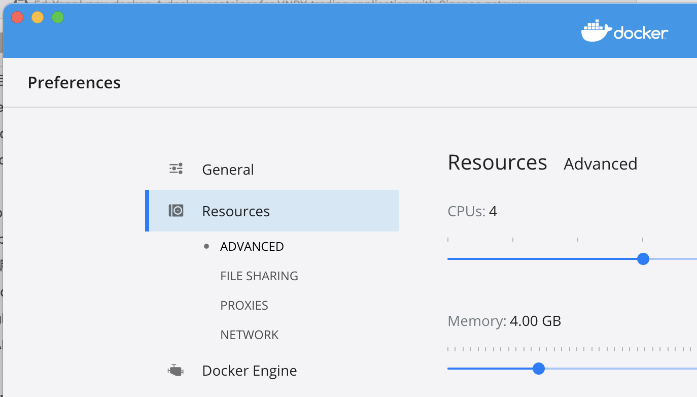
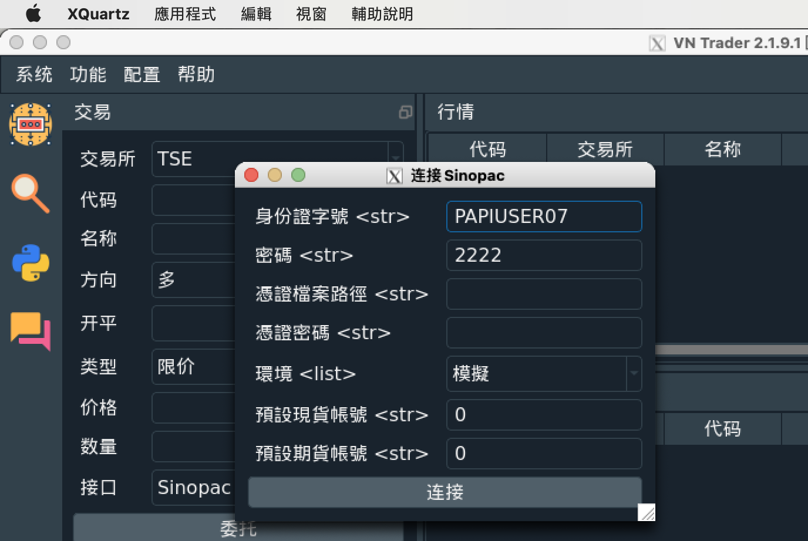
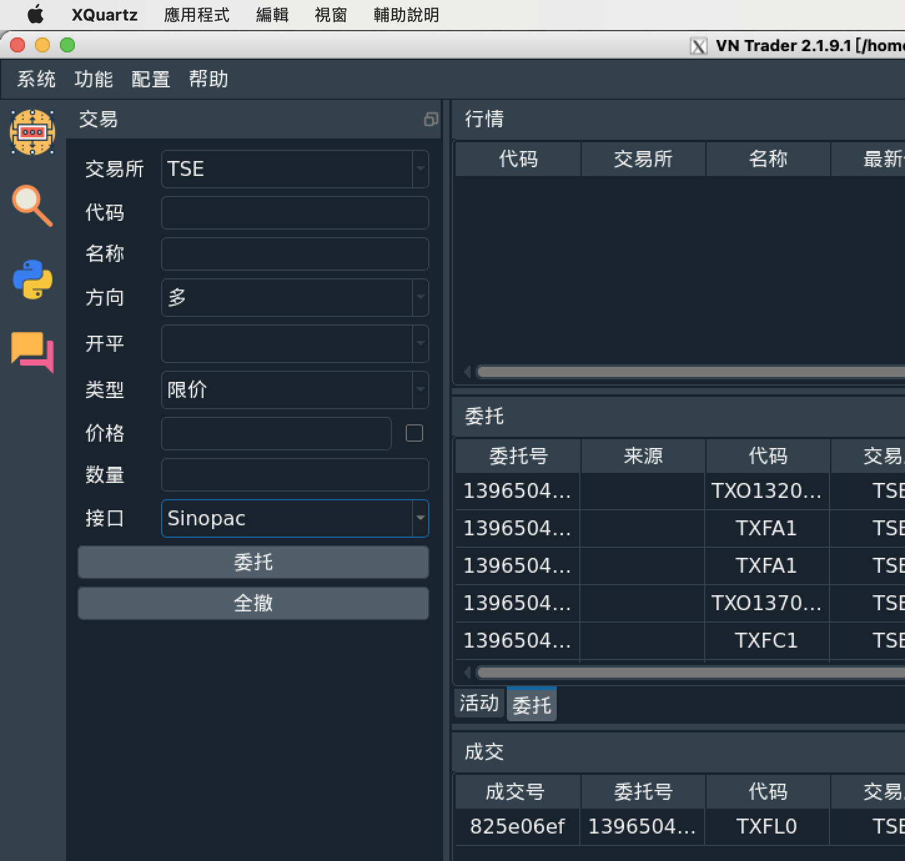

# A Container of VNPY with Sinopac Gateway

    The purpose of this project is for ease of setup VNPY trading application. 

    With this project, the VNPY is running in a docker container, then user can use SSH to access the VNPY in the container. 

    ```shell
    +--------------+                             +------------------------------------+
    | Host machine |---> SSH (port 23456) --->   | Container (Ubuntu 18.04 with VNPY) |
    +--------------+                             +------------------------------------+
    ```

## Test environment

It should work on other platforms, but currently it has been only tested on:

* Macbook Pro (Intel) with Docker Desktop.

## VNPY container

For compiling successfully the ta-lib, it have to configure the  4GB+ memory resources.



### Prepare VNPY container

    * Pull from Docker Hub (recommended)

    ```shell
    docker pull edwardyang/vnpy
    ```

    ```shell
    $ docker images
    
    REPOSITORY        TAG       IMAGE ID       CREATED          SIZE
    edwardyang/vnpy   latest    7813668517cc   41 minutes ago   5.53GB
    ```

    * Build from Dockerfile (it take hours)

    Clone source code:

    ```shell
    git clone https://github.com/Ed-Yang/vnpy-docker.git
    ```

    Build VNPY container:

    <yourname>: the user name (also used as default password) of Linux's account.

    ```shell
    cd vnpy-docker
    docker build -t vnpy --build-arg USERNAME=<yourname> .
    ```

    ```shell
    $ docker images

    docker images
    REPOSITORY   TAG       IMAGE ID       CREATED         SIZE
    vnpy         latest    7813668517cc   4 minutes ago   5.53GB
    ```

### Run VNPY container

* Setup environment variable

    <root-of-repo>: the root path of this repo.
    <yourname>: the login name given in container building

    ```shell
    export VNPY_ROOT=<root-of-repo>
    export USERNAME=<yourname>
    ```

* Setup working folder

    In local host:

    ```shell
    cp -r $VNPY_ROOT/examples $VNPY_ROOT/run
    ```

* Start VNPY container

    Pull from Docker Hub:

    ```shell
    docker run --rm --name vnpy -v $VNPY_ROOT/run:/home/$USERNAME/workspace/run -p 23456:23456 -it edwardyang/vnpy
    ```

    Build from Dockerfile:

    ```shell
    docker run --rm --name vnpy -v $VNPY_ROOT/run:/home/$USERNAME/workspace/run -p 23456:23456 -it vnpy
    ```

## VNPY trading application

    Currently, the VPNY container only support SSH connection.

### Local Host - Setup SSH

* macOS

    First, install X windows client [XQuartz][https://www.xquartz.org].

    Add an config "vnpy" in ~/.ssh/config:

    ```shell
    Host vnpy
    User <yourname>
    HostName localhost
    Port 23456
    SendEnv LANG LC_*
    XAuthLocation /opt/X11/bin/xauth
    ForwardAgent yes
    ForwardX11 yes
    SendEnv TERM=xterm-256color
    ```

    Setup SSH password:

    ```shell
    # remove old key
    ssh-keygen -R [localhost]:23456  # or remove manually from ~/.ssh/known_hosts
    ssh-copy-id vnpy # setup passwd
    ```

    Connect to VNPY container:

    In host, open a shell terminal, and run:

    ```
    ssh -X vnpy
    ```

### Login VNPY

* Sinopac account

    There are 10 of test accounts PAPIUSER01~PAPIUSER10 (All of the account's password are 2222) which can be used to connect
    to Sinopac gateway.

    There are limited functions available the simulation environment, so it is suggested to use real account to test VNPY.

    Logging with real account, you could get the live tick and also your current orders.

    It if you want to place order, you have to provide the certificate additionly.

    i.e. In host, copy the certificate to the working folder:

    ```shell
    cp Sinopac.pfx $VNPY_ROOT/run
    ```

* After SSHed in container, execute the following commands and the VNPY application window will show up.

    In container:

    ```shell
    cd workspace/run
    python run.py
    ```

Logging:



After logged in with simulation account:



* For the basic usage of VNPY, you can refer to: 
    - [在 VNPY 上交易台灣股票、期貨](https://blog.alvin.tw/Shioaji-With-Vnpy/) or
    - [VnTrader基本使用](https://github.com/vnpy/vnpy/wiki/VnTrader基本使用).

## Reference

System

* [Remote SSH with GUI](https://virtualizationreview.com/articles/2017/02/08/graphical-programs-on-windows-subsystem-on-linux.aspx)
* [Developing inside a Container](https://code.visualstudio.com/docs/remote/containers)

VNPY

* [VnTrader基本使用](https://github.com/vnpy/vnpy/wiki/VnTrader基本使用)
* [在 VNPY 上交易台灣股票、期貨](https://blog.alvin.tw/Shioaji-With-Vnpy/)
* [vn.py量化交易接口](https://www.vnpy.com/forum/topic/3120-30duo-tao-apijie-kou-huan-pa-man-zu-bu-liao-ni-de-liang-hua-jiao-yi-xu-qiu)

Sinopac

* [在 VNPY 上交易台灣股票、期貨](https://blog.alvin.tw/Shioaji-With-Vnpy/)
* [聊天室](https://gitter.im/Sinotrade/Shioaji?utm_source=badge&utm_medium=badge&utm_campaign=pr-badge)
* [Shioaji User Guide](https://sinotrade.github.io/quickstart/)
* [MAC 總管 供MAC電腦 申請/更新/查詢憑證](https://w3.sinotrade.com.tw/CSCenter/CSCenter_13_3)

## Q/A 

* Install ta-lib failed. error message: note: expected ‘const TA_FuncHandle **’

It's due to gcc run out of memory, enlarge the RAM size in Docker's preference and rebuilt it.

* qt.qpa.xcb: could not connect to display

```shell
ssh -X vnpy
```

* convert BIG-5

iconv -f BIG-5 -t UTF-8 excd.csv

* warnings.warn("urllib3 ({}) or chardet ({}) doesn't match a supported "

Re-install requests to resolve:

```shell
pip install requests
```
